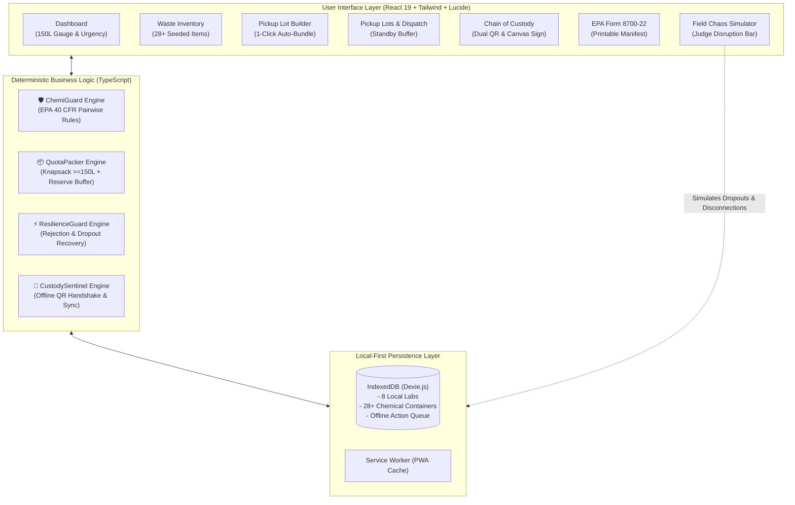

# HazardHub AI ☣️
### Small Lab Hazardous Waste Cooperative Pickup Board & Offline Custody Platform
*Prepared for the Oaks AI Builders Challenge — Submission by Shatha varsha Sree T.*

[](https://react.dev/)
[](https://www.typescriptlang.org/)
[](https://vitejs.dev/)
[](https://tailwindcss.com/)
[](https://dexie.org/)
[](LICENSE)

---

## 1. Executive Summary & The Core Problem

Small institutions—such as high school chemistry departments, private dental clinics, veterinary pathology labs, and water testing facilities—generate small batches of dangerous chemical waste. Licensed industrial disposal haulers **refuse to dispatch collection trucks unless a combined regional pickup reaches at least 150 Liters**.

Because of this rigid volume threshold, small institutions are forced to hoard expired ethers, fuming nitric acid, and spent toxic solvents in unventilated closets for months.

**HazardHub AI** is an intelligent, local-first cooperative coordination platform where neighboring laboratories pool waste containers, reach minimum pickup quotas together, enforce strict EPA chemical compatibility laws, survive last-minute dropouts, and record offline-resilient chain-of-custody handoffs.

---

## 2. Core Architectural Design Principle

> **"AI recommends and explains; deterministic systems make safety-critical decisions."**

In hazardous waste logistics, an LLM hallucination can cause catastrophic chlorine gas clouds or explosions. HazardHub AI resolves this by separating roles:
- **The GenAI Operations Agent** acts as an orchestrator: interpreting natural language and executing approved tools.
- **Deterministic TypeScript Engines** make all regulatory, chemical, and quota calculations:
  - 🛡️ **ChemiGuard**: Enforces EPA 40 CFR Part 264 Appendix V compatibility rules.
  - 📦 **QuotaPacker**: Solves the constrained knapsack problem ($\ge 150\text{L} + 15\%$ safety reserve).
  - ⚡ **ResilienceGuard**: Dynamically recovers lots when canisters leak or labs cancel.
  - 🔏 **CustodySentinel**: Manages cryptographic offline QR payloads and IndexedDB auto-sync queues.



---

## 3. Four Core Engines Detailed

### 🛡️ 1. ChemiGuard — Chemical Incompatibility Engine
Evaluates every proposed combination against EPA 40 CFR Part 264 Appendix V and DOT 49 CFR 177.848:
- **Acids + Bases** ➔ Blocks violent exothermic neutralization & corrosive spattering (e.g. $HCl + NaOH$).
- **Acids + Cyanides/Sulfides** ➔ Blocks lethal gas generation (fatal $HCN$ or $H_2S$ release).
- **Strong Oxidizers + Flammable Organics** ➔ Blocks explosion and violent fire hazard (e.g. fuming $HNO_3 + \text{Acetone/Xylene}$).
- **Bleach + Ammonia** ➔ Blocks toxic chloramine vapor ($NH_2Cl$) and explosive $NCl_3$ formation.
- **Diagnostics**: When a violation occurs, ChemiGuard generates high-contrast diagnostic cards detailing the exact chemical pair, consequence, and scientific remediation.

### 📦 2. QuotaPacker — Pooling & 1-Click Auto-Bundle
- Configurable minimum threshold (default **150 Liters**).
- **Dynamic Reserve Buffer ($150\text{L} + 15\% \approx 172.5\text{L}$)**: Prevents the "cancellation trap" by deliberately over-bundling compatible volume and designating 1–2 nearby non-critical containers as **Standby Reserves**.
- **1-Click AI Auto-Bundle**: Prioritizes urgent expiring waste (< 14 days), checks $O(N^2)$ compatibility, and forms a valid lot instantly.

### ⚡ 3. ResilienceGuard — Disruption & Recovery Engine
- **Partial Hauler Rejection**: When a driver flags a 20L drum as `DAMAGED` or `LEAKING` at the loading dock, ResilienceGuard quarantines the drum, recalculates volume, and promotes a standby container to save the pickup.
- **Last-Minute Lab Withdrawal**: If a facility cancels 30 minutes before pickup, ResilienceGuard identifies compatible standby containers from remaining facilities to preserve the 150L quota.

### 🔏 4. CustodySentinel — Offline Field Handshake
- **Dead-Zone Loading Docks**: Basements have zero cell reception. CustodySentinel persists all transitions to `IndexedDB` with cryptographic tokens.
- **Dual-Key QR Handshake**:
  1. Lab Technician reviews inventory and signs on HTML5 Canvas.
  2. App generates a timestamped, signed QR code payload with manifest checksum.
  3. Driver scans QR code offline; both devices capture a mutual verification hash.
  4. When connectivity returns, the `SyncQueueService` automatically flushes and reconciles all records.

---

## 4. Evaluator Demo Walkthrough (11-Step Judge Demo Story)

1. **Dashboard Overview**: Open [http://127.0.0.1:5173/](http://127.0.0.1:5173/). Notice the 150L quota progress bar, urgent waste countdown, and 8 seeded labs.
2. **AI Operations Console**: Navigate to `AI Operations`. Ask: *"Can we create a pickup lot for tomorrow?"*
3. **Automated Tool Calling**: The agent executes `QuotaPacker.proposeOptimalLot(150)` and returns a detailed briefing. Click **"Open Pickup Builder"**.
4. **1-Click Auto-Bundle**: In the Pickup Builder, click **"1-Click AI Auto-Bundle"**. Watch the confetti trigger as a safe 172L lot is assembled.
5. **Test Chemical Safety Block**: Check the box for *Nitric Acid 68%* and *Spent Acetone*. Watch **ChemiGuard immediately block finalization** with an explosion alert! Remove the offending item.
6. **Finalize Pickup Lot**: Click **"Finalize & Schedule Lot"**. The lot is saved in IndexedDB and displayed in `Pickup Lots`.
7. **Simulate Hauler Rejection**: In the lot card, click **"Simulate Canister Rejection (Leaking/Damaged)"**. Select a 20L drum.
8. **Watch ResilienceGuard Recover Quota**: ResilienceGuard alerts that volume dropped to 130L, automatically promotes a standby reserve container (+20L), and restores the quota in 1 click!
9. **Simulate Dead Zone / Offline Mode**: In the bottom **Chaos Simulator dock**, click **"Offline"**. The network status banner turns red.
10. **Dual-Key QR Sign-Off**: Go to `Chain of Custody`. Sign the technician canvas, generate the offline QR code, click **"Simulate Driver Phone QR Scan"**, sign the driver canvas, and click **"Accept Legal Custody"**.
11. **Printable EPA Form 8700-22 Manifest**: Return to `Pickup Lots`, click **"EPA Manifest"**, and view the authentic federal hazardous waste manifest with print-ready styling (`@media print`).

---

## 5. Seeded Realistic Dataset

Seeded with **8 distinct local facilities** and **30 chemical waste containers**:
- **Oakridge High School Science Dept** (AP Chem lab: Nitric acid 68%, Glacial acetic acid, Potassium permanganate).
- **Apex Dental Surgery & Endodontics** (Dental clinic: Spent glutaraldehyde sterilant, silver amalgam/mercury sludge, concentrated bleach).
- **St. Jude Pathology & Histology Lab** (Medical histology: Spent xylene, buffered formalin 10%, histology ethanol rinses).
- **BioPure Environmental Water Testing** (Water testing: Sulfuric acid COD digest vials, sodium hydroxide titration effluent, sodium cyanide standard).
- **Metro Dermatology & Laser Center** (Dermatology: Trichloroacetic acid peel waste, phenol antiseptic, concentrated ammonia).
- **Riverdale Veterinary Diagnostics** (Veterinary clinic: Biopsy formalin, surgical prep residue, chlorinated disinfectant).
- **Veritas Forensics & Toxicology Lab** (Toxicology: Dichloromethane, HPLC acetone/acetonitrile, chloroform extract).
- **Precision Tech Materials Incubator** (Materials R&D: Hydrofluoric acid 48%, battery electrolyte, potassium hydroxide wafer etchant).

---

## 6. Core Trade-offs & Production Next Steps

| Architectural Decision | Chosen Trade-Off | Rationale |
| :--- | :--- | :--- |
| **Local-First IndexedDB vs. Cloud DB** | IndexedDB (`Dexie.js`) | Eliminates credential requirements, runs 100% free on static hosting, and guarantees zero-downtime field operation in basement docks. |
| **Deterministic Rules vs. LLM Safety** | Pure TypeScript Matrix | LLMs hallucinate chemical reactions. Legal compliance requires auditable, deterministic rule enforcement. |
| **Greedy Knapsack with Reserve Buffer** | 15% Buffer over Exact 150L | Protects small labs from total pickup cancellations when individual drums fail field inspection. |

### Production Roadmap:
1. **Physical Barcode Scanner Integration**: Integrate WebRTC camera feed via `html5-qrcode` for scanning physical container drum labels.
2. **EPA e-Manifest XML Export**: Implement EPA RCRA-Info CDX API connector for official electronic manifest submission.
3. **Multi-Truck Route Optimization**: Integrate Google Maps / OSRM API for turn-by-turn hazmat-permitted routing.

---

## 7. Local Development & Setup

### Prerequisites
- Node.js v20+ LTS

### Installation
```bash
# Clone repository
git clone https://github.com/shathavarsha/hazardhub.git
cd hazardhub

# Install dependencies
npm install

# Start local development server
npm run dev

# Run ChemiGuard automated safety verification suite
npx tsx src/engines/chemiguard/test-runner.ts

# Build production bundle
npm run build
```

---
*Built with React 19, TypeScript, Vite, TailwindCSS, and Dexie.js for the Oaks AI Builders Challenge.*
