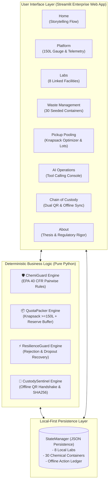

# HazardHub AI ☣️
### Small Lab Hazardous Waste Cooperative Pickup Board & Offline Custody Platform
*Prepared for the Oaks AI Builders Challenge — Submission by Shatha varsha Sree T.*

[](https://www.python.org/)
[](https://streamlit.io/)
[](https://docs.pytest.org/)
[](https://www.epa.gov/)
[](LICENSE)

---

## 1. Executive Summary & The Core Problem

Small institutions—such as high school chemistry departments, private dental clinics, veterinary pathology labs, and water testing facilities—generate small batches of dangerous chemical waste. Licensed industrial disposal haulers **refuse to dispatch collection trucks unless a combined regional pickup reaches at least 150 Liters**.

Because of this rigid volume threshold, small institutions are forced to hoard expired ethers, fuming nitric acid, and spent toxic solvents in unventilated closets for months.

**HazardHub AI** is an intelligent, local-first cooperative coordination platform where neighboring laboratories pool waste containers, reach minimum pickup quotas together, enforce strict EPA chemical compatibility laws, survive last-minute dropouts, and record offline-resilient chain-of-custody handoffs.

---

## 2. Core Architectural Design Principle

> **"AI recommends and explains; deterministic systems make safety-critical decisions."**

In hazardous waste logistics, an LLM hallucination can cause catastrophic chlorine gas clouds or explosions. HazardHub AI resolves this by separating roles:
- **The GenAI Operations Agent** acts as an orchestrator: interpreting natural language and executing approved tools.
- **Deterministic Python Engines** make all regulatory, chemical, and quota calculations:
  - 🛡️ **ChemiGuard**: Enforces EPA 40 CFR Part 264 Appendix V compatibility rules.
  - 📦 **QuotaPacker**: Solves the constrained knapsack problem ($\ge 150\text{L} + 15\%$ safety reserve).
  - ⚡ **ResilienceGuard**: Dynamically recovers lots when canisters leak or labs cancel.
  - 🔏 **CustodySentinel**: Manages cryptographic offline QR payloads and SHA-256 manifest hashes.



---

## 3. Pure Python File Layout

```
hazardhub/
├── app.py                     # Streamlit enterprise web application (8 dedicated pages)
├── run.py                     # Master launcher script with pre-flight safety checks
├── verify_app.py              # 7-stage comprehensive automated verification suite
├── models.py                  # Core dataclasses (Lab, WasteItem, PickupLot, CustodyEvent)
├── requirements.txt           # Python dependencies
├── data/                      # Initial cooperative seed data
│   ├── labs.py                # 8 municipal laboratories and clinics
│   ├── matrix.py              # EPA 40 CFR Part 264 Appendix V compatibility rules
│   └── waste.py               # 30 chemical waste containers
├── engines/                   # 4 deterministic safety engines
│   ├── chemiguard.py          # EPA pairwise safety validator
│   ├── quotapacker.py         # Knapsack optimizer (>=150L + 15% safety buffer)
│   ├── resilienceguard.py     # Disruption self-healing on dock rejections
│   ├── custodysentinel.py     # SHA-256 manifest hasher & offline QR generator
│   └── test_runner.py         # Pytest test suite
├── agent/                     # Autonomous AI operations agent
│   ├── agent.py               # Natural language intent parser
│   └── tools.py               # Structured tool calling functions
├── storage/                   # Local-first persistence
│   └── state.py               # StateManager and offline network simulation
└── components/                # UI components
    ├── manifest.py            # EPA Form 8700-22 printable manifest HTML
    └── styles.py              # Modern corporate environmental CSS design system
```

---

## 4. Quick Start & Execution

### 1. Install Dependencies
```bash
pip install -r requirements.txt
```

### 2. Run Deterministic Tests
```bash
python run.py --test
# Or using pytest directly:
python -m pytest engines/test_runner.py -v
```

### 3. Launch Web Application
```bash
python run.py
# Or directly via streamlit:
streamlit run app.py
```
Open **`http://localhost:8501`** in your browser.

---

## 5. Automated Verification Results

All 7 verification stages pass with 100% success:
- `[OK] Step 1: StateManager (8 Labs, 30 Waste Items, Local-First Persistence)`
- `[OK] Step 2: ChemiGuard Engine (Nitric Acid + Acetone BLOCKED with EXPLOSION)`
- `[OK] Step 3: QuotaPacker Knapsack Engine (Auto-Bundle >= 150L + 15% Buffer)`
- `[OK] Step 4: ResilienceGuard (Canister Rejection Resolved & Standby Promoted)`
- `[OK] Step 5: CustodySentinel (Cryptographic SHA-256 Checksum & Offline QR Image)`
- `[OK] Step 6: EPA Form 8700-22 Manifest (Official Uniform Manifest Rendered)`
- `[OK] Step 7: AI Operations Agent (Natural Language Tool Calling Verified)`
